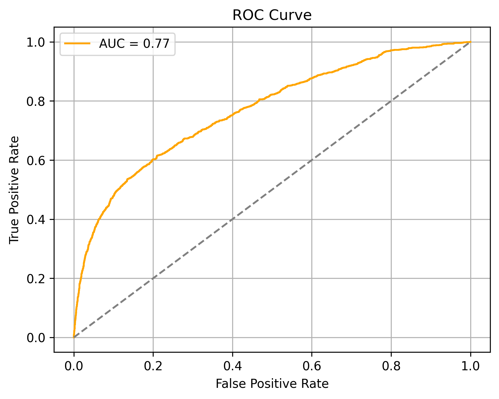
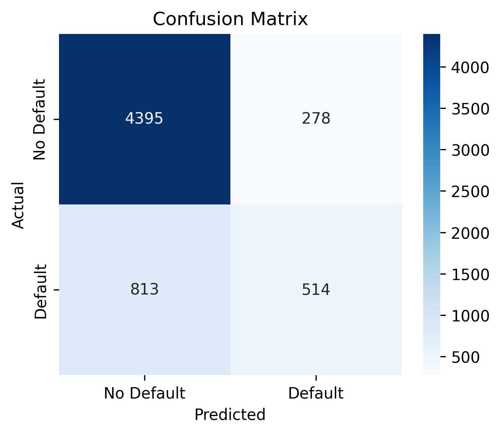
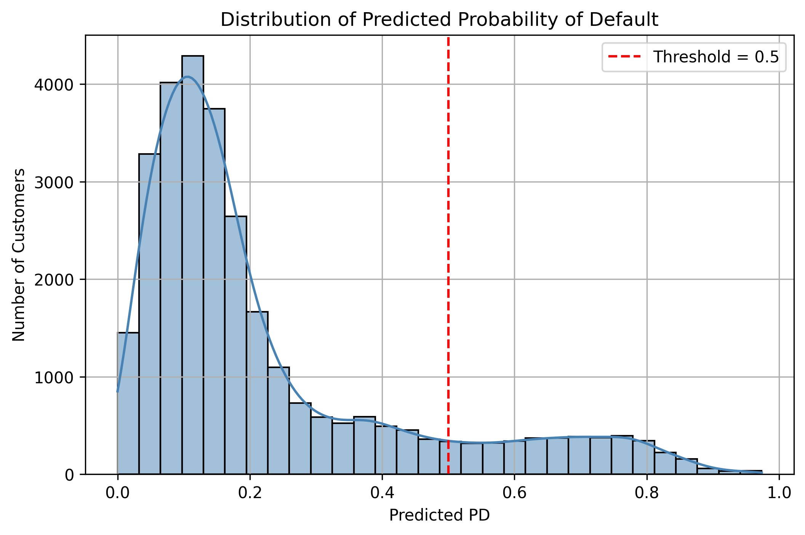
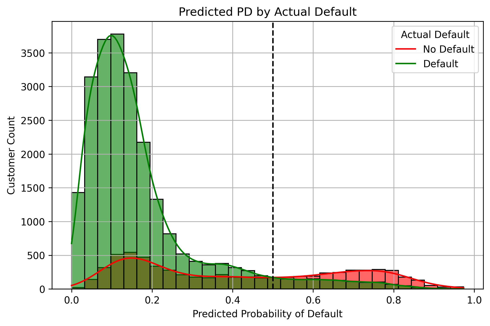
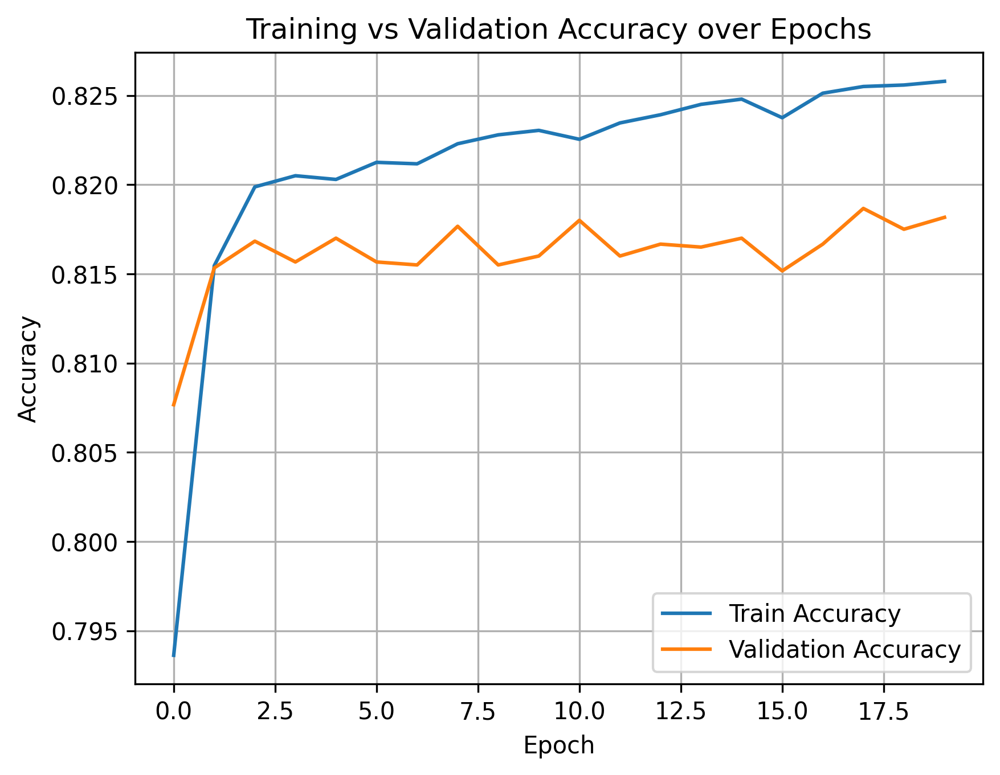

# 💳 Credit Default Prediction using Artificial Neural Networks (ANN)

Can we predict whether a credit card customer will default next month?

This project uses an **Artificial Neural Network (ANN)** built with TensorFlow/Keras to predict the **probability of default (PD)** based on client financial behavior and credit history. The model was trained and evaluated on real-world data from 30,000 credit card clients.

---

## 🧠 Project Highlights

- 📂 Dataset: Credit card client default data (UCI repository)
- 🤖 Model: ANN with 2 hidden layers using TensorFlow & Keras
- 🎯 Target: Predict `default payment next month` (binary classification)
- 📈 Output: Both binary classification and probability of default
- ✅ Evaluation: Accuracy, Precision, Recall, AUC, Calibration

---

## 🧪 Features & Workflow

- Preprocessing: scaling, train-test split, data cleaning
- Model: Feedforward neural network with ReLU + sigmoid
- Evaluation: Confusion matrix, ROC-AUC, PD visualization
- Visualization: Easy-to-read plots for insight and interpretation

---

## 📊 Visual Results

### 🎯 ROC Curve

### 🟩 Confusion Matrix

### 📊 Distribution of Predicted Probability

### 🔍 PD Split by Actual Default Status

### 📈 Training vs Validation Accuracy

---

## 🧾 How to Run

### ⚙️ Install Dependencies

pip install -r requirements.txt

---

## 📚 Dataset Reference

Yeh, I. C., & Lien, C. H. (2009). The comparisons of data mining techniques for the predictive accuracy of probability of default of credit card clients. *Expert Systems with Applications.*

📂 [UCI ML Repository](https://archive.ics.uci.edu/ml/datasets/default+of+credit+card+clients)

---

## 🙌 About Me

If you're working on financial risk modeling, machine learning, or applied deep learning — let’s connect!

👤 **Surajit Biswas**  
🔗 ## Connect with Me 
📫 surajitbiswas.iiserb@gmail.com

---

## 🏷️ Tags

`Artificial Neural Network` `Credit Risk Modeling` `TensorFlow` `Machine Learning` `Data Science` `Finance AI`
